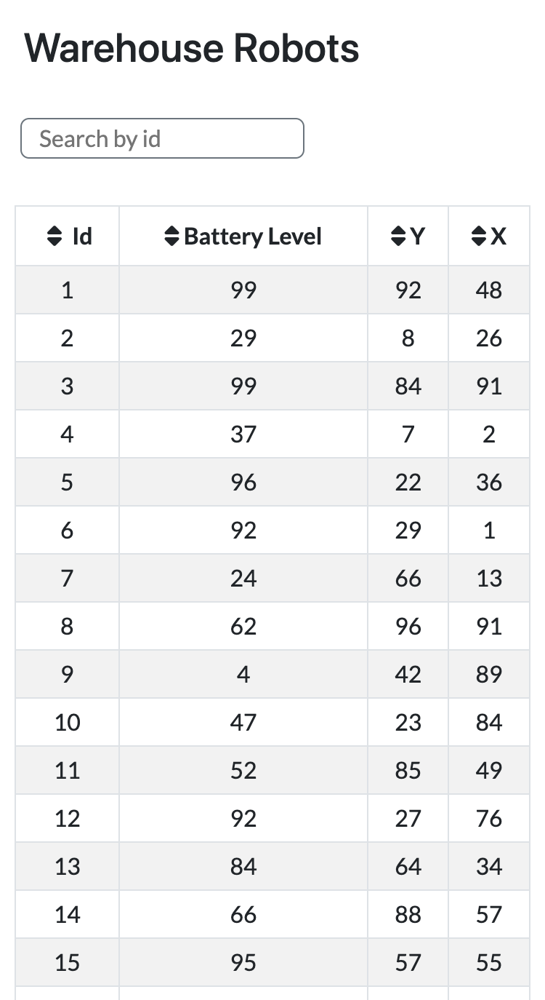
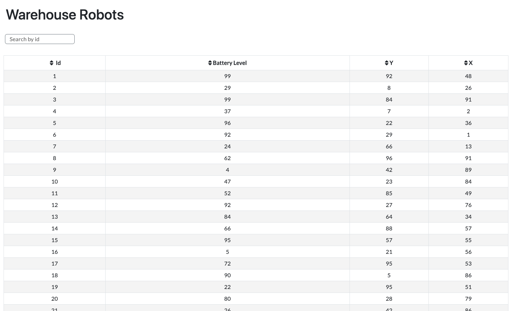

# SVT - Warehouse Robots

## Table of contents

- [Overview](#overview)
- [Getting Started](#getting-started)
- [Built with](#built-with)
- [Screenshots](#screenshots)
- [Next Steps](#next-steps)

## Overview

This web application allows users to:

- view all robots in the warehouse
- sort robots by robot id, battery level, x-coordinate, or y-coordinate
- search for robots by id

## Getting started

Fork this repository then clone your fork to your local machine.

```bash
git clone https://github.com/<YOUR_GITHUB_USERNAME>/svt-portal-takehome.git
```

Navigate to the folder containing the repository and start a local server. For example you may use _lite-server_.

```bash
npx lite-server
```

> **lite-server** is a lightweight _development only_ node server that serves a web app, opens it in the browser, and refreshes when html or javascript changes occur.

Open the code in your favourite editor. For instance, to open VSCode:

```bash
code .
```

## Built with

- Semantic HTML5 markup
- Bootstrap
- CSS
- JavaScript

## Screenshots

<mark> Mobile Screenshot </mark>


<mark> Desktop Screenshot </mark>


## Next Steps

- make table heading sticky so it's easy to see the column headings as you sroll vertically to view all robot data

- add tooltip to the table column headings so users know that they can click the heading to sort by column in ascending/descending order
